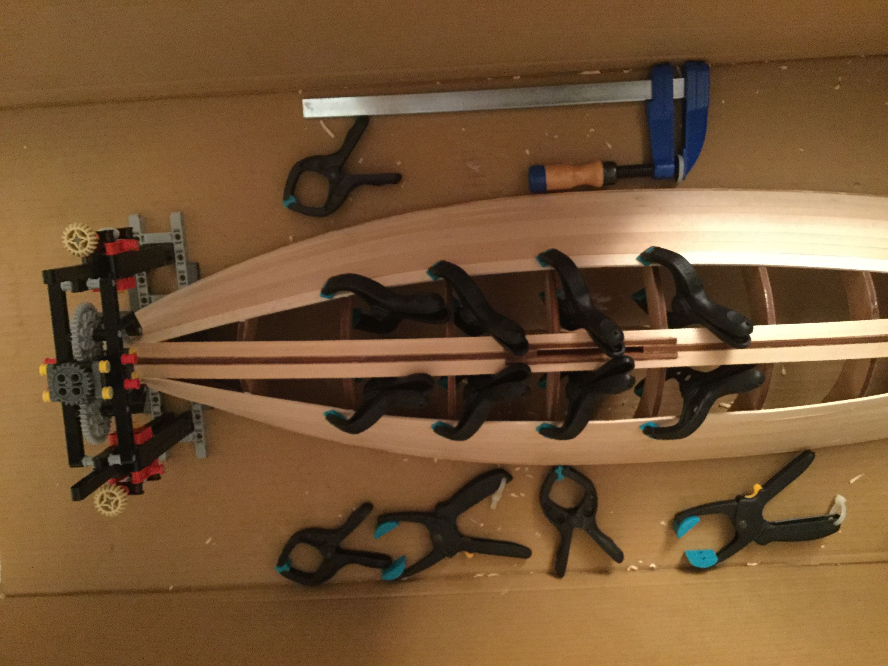
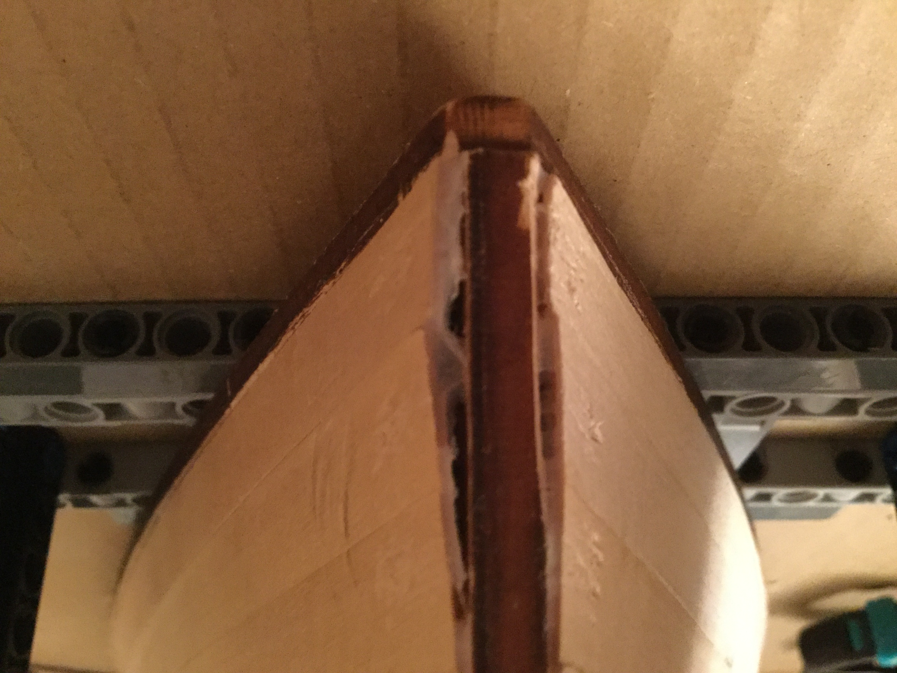

# Gupy

 
 
### The idea

- The project started when i was 14 yo, i wanted to build an RC sailboat from scratch, my dad helped me to build up most of the basis (designing and creating the hull).
- The project was abandoned for 2 years : School / Covid / Laziness (mostly the last reason).
- I now want to finish the project to have a base to program on embedded electronics in Rust

This repo record the evolution of the making from scratch of a 0.7meters RC sailboat in wood.

***
## Designing the hull

The hull was designed on [FreeCad](https://www.freecad.org/) with a Python macro by dad. Code here: [macro_hull_skeleton.fcmacro](macro_hull_skeleton.fcmacro) (french).

 

## Creating the skeleton

**TODO**

## Adding the slats

This part was tricky, each wooden slate needs to be strongly  maintained for 24h along the hull.
At the beginning, simple clamps are adequate.

But it is more complex for the top slats, notably for the nose of the boat.
A home-made Lego clamp helped a lot here.

&nbsp;&nbsp;&nbsp;&nbsp;&nbsp;&nbsp;

The nose needed multiple attempts to be glued correctly.

Then, the hull was sanded down, to remove most of the defects and irregularities.

The apertures are filled with a mix of glue and wood dust (~50/50)

  

Now the structure of the hull is done !

## Making the hull stronger !

To make the hull **water-proof** and strong, epoxy resin needs to be applied over.
[This ressource](https://navi.modelisme.com/article138.html)  (in French) helped me to create the resin in the right proportions.
**TODO**
